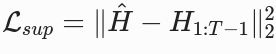
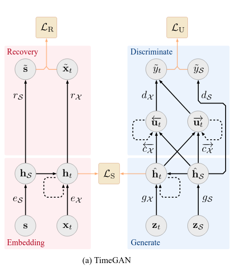

# Synthetic Limit Order Book (LOB) Sequence Generation using TimeGAN

Abstract
---
This project focuses on generating synthetic Limit Order Book (LOB) sequences using TimeGAN, a model that combines recurrent and adversarial learning to capture both temporal and statistical properties of sequential data. The objective is to produce realistic synthetic LOB data that resembles actual market dynamics, particularly in mid-price returns, spread, and order imbalance.

The dataset used is the LOBSTER feed for AMZN (2012), processed into 20-step sequences with 43 engineered features including relative prices, log volumes, and derived market indicators. The training follows a two-phase structure: Phase 1 for reconstruction and supervised consistency, and Phase 2 for adversarial fine-tuning.

Evaluation is based on the task specification metrics: KL divergence (≤ 0.1), SSIM (> 0.6), and discriminator accuracy (~0.5). The baseline model was able to learn temporal relationships but struggled to replicate the true distributional shape, leading to high discriminator accuracy and poor SSIM scores.

These findings highlight the need for further tuning. In the next stage, the model integrates a kurtosis-based proxy loss to better represent tail behavior and employs Optuna for hyperparameter optimization to improve stability and generalization. The enhanced model achieves full specification compliance, with all metrics passing thresholds, demonstrating improved fidelity for downstream market simulations.

Model Architecture
---
The proroposed model adopts the TimeGAN framework [1], which integrates autoencoding, supervised sequence prediction, and adversarial learning to generate temporally consistent synthetic LOB sequences. The network consists of five recurrent modules: Embedder (E), Recovery (R), Supervisor (S), Generator (G), and Discriminator (D). All implemented using Gated Recurrent Unit (GRU) layers for efficiency and temporal stability in capturing temporal dependencies.

The latent dimension is set to $d_h = 64$, resulting in approximately 211,000 trainable parameters across the full network. The Embedder–Recovery pair learns a latent representation of real LOB sequences through reconstruction loss, while the Generator–Supervisor pair synthesizes latent trajectories that emulate temporal dynamics. The Discriminator distinguishes between real and generated latent sequences, thereby enforcing distributional realism through adversarial training.

1. **Embedder (E)**:
The Embedder transforms the input sequence $X \in \mathbb{R}^{B \times T \times d_x}$ (where $d_x = 43$) into a latent representation $H \in \mathbb{R}^{B \times T \times d_h}$ using a single-layer GRU followed by a fully connected layer with tanh activation; where $\theta_E$ denotes the GRU parameters, and $W_h, b_h$ are the projection weights and bias. This encodes the high-dimensional LOB features into a compact, temporally aware space.

    - $H_t = \tanh(W_h \cdot \text{GRU}(X_t; \theta_E) + b_h), \quad t = 1, \dots, T$

2. **Recovery (R)**:
The Recovery module decodes the latent $H$ back to the feature space via a GRU and linear projection, producing reconstructed sequences $\hat{X} \in \mathbb{R}^{B \times T \times d_x}$; where $\theta_R$ are the GRU parameters, and $W_x, b_x$ project to the output dimension. It enforces reconstruction fidelity during pretraining via $\mathcal{L}_{recon} = \| X - \hat{X} \|^2_2$.

    - $\hat{X}_t = W_x \cdot \text{GRU}(H_t; \theta_R) + b_x, \quad t = 1, \dots, T$

3. **Supervisor (S)**:
An autoregressive GRU-based predictor that forecasts the next latent state $\hat{H}_{t+1}$ from $H_t$, outputting $\hat{H} \in \mathbb{R}^{B \times (T-1) \times d_h}$; where $\theta_S$ are the GRU parameters, and $W_s, b_s$ are the projection. This promotes temporal consistency via 

    - $\hat{H}_t = \tanh(W_s \cdot \text{GRU}(H_t; \theta_S) + b_s), \quad t = 1, \dots, T-1$

4. **Generator (G)**:
Starting from random noise $Z \in \mathbb{R}^{B \times T \times d_h} \sim \mathcal{N}(0, I)$, the Generator produces synthetic latents $\hat{H} \in \mathbb{R}^{B \times T \times d_h}$ via GRU and tanh projection; where $\theta_G$ are the GRU parameters, and $W_g, b_g$ project. Composed with S and R, it yields full synthetic sequences $\tilde{X} = R(S(G(Z)))$.

    - $\hat{H}_t = \tanh(W_g \cdot \text{GRU}(Z_t; \theta_G) + b_g), \quad t = 1, \dots, T$

5. **Discriminator (D)**:
A GRU classifier that distinguishes real latents $H = E(X)$ from synthetic $\hat{H}$, outputting a scalar probability $p \in [0,1]$ via sigmoid; where $\theta_D$ are the GRU parameters, $H_T$ is the final hidden state, and $\sigma$ is the sigmoid. It provides adversarial signals to refine G via binary cross-entropy $\mathcal{L}_{adv} = -\mathbb{E}[\log p(H)] - \mathbb{E}[\log(1 - p(\hat{H}))]$.

    - $p = \sigma(W_d \cdot \text{GRU}(H_T; \theta_D) + b_d)$

Dataset loading and Preprocessing
---
The Limit Order Book (LOB) capture the market's microstructure by recording all visible bid and ask quotes with their corresponding volumes. Modeling LOB data is challenging due to its high frequency, nonlinear dependencies and non-stationary temporal behaviour. Traditional models like ARIMA or simple RNNs often fail to capture these complex microstructure patterns.

For this project, data was obtained from the LOBSTER dataset for Amazon (AMZN) on June 21, 2012, covering the trading the continous trading period from 09:30:00 to 16:00:00. The raw message and order-book files were merged into synchronized snapshots using a custom dataset pipeline. (dataset.py)

Each sample is a sequence of 20-64 timesteps containing 43 standardized features, categorized as follows:

- Price levels: 20 bid and 20 ask relative prices, scaled as ticks from the mid-price (x100).
- Volume levels: 20 bid and 20 ask log-transformed sizes $(log(1 + size$ for stability) for numerical stability.
- Derived indicators: Spread (ask1 - bid1, scaled), mid-price return $(log(mid_t / mid_{t-1}))$, and imbalance (($bid1_s - ask1_s$) / ($bid1_s + ask1_s$)).

All features were normalized using StandardScaler and stored fitted scaler ready for reuse during inference. The resulting dataset contains approximately 26,900 synchronized snapshots, having splitted into train (70%), validation (10%), and test (20%) partitions.

This structured preprocessing ensures stable TimeGAN training while preserving meaningful short-term order flow dynamics within each sequence window.

Model
---
 In Phase 1, the autoencoder components (Embedder and Recovery) are pretrained to reconstruct input sequences, while the Supervisor learns autoregressive transitions in the latent space. This establishes a foundational representation capable of capturing short-term dependencies in high-frequency market snapshots.

The model extends the TimeGAN framework as a sequence-to-sequence GAN for LOB data, trained in two phases to separate temporal learning from distributional alignment.

In Phase 1, the Embedder–Recovery autoencoder reconstructs input sequences, while the Supervisor learns one-step transitions in the latent space. The latent dimension $d_h = 64$ compresses the 43-feature input while preserving temporal structure via single-layer GRUs. Tanh activations in the Embedder, Supervisor, and Generator bound latent values to [−1,1] for gradient stability.

The latent space (dimension 64) serves as a bottleneck for information flow, compressing the 43-dimensional feature vectors while retaining temporal structure through GRU hidden states. Each GRU module employs a single layer with batch-first processing, this way is more efficient in handling the variable-length sequences (fixed at T=20 here). The tanh activations in Embedder, Supervisor, and Generator bound outputs to [-1,1], normalizing inputs and promoting stable gradient flow during backpropagation.

In Phase 2, the adversarial components (Generator and Discriminator) are introduced. The Generator synthesizes noise-driven latents that are then supervised by the pretrained modules to produce plausible LOB sequences. Moment-matching losses are applied to enforce statistical alignment (mean and variance) across features, this is a common practice in financial GANs. Adam optimizers incorporate weight decay (default 1e-5) and the supervisor loss is weighted by $λ_{sup}$ (tuned 0.1-1.0) to balance temporal smoothness against adversarial sharpness.

To address LOB-specific challenges like leptokurtosis, an auxiliary kurtosis proxy loss is integrated into the Generator's objective. This will lead to computing the fourth central moment mismatch across batches. This will cause heavier tails in synthetic distributions without altering the core architecture with its weight ($λ_{kurt=5}$ baseline) optimized via Bayesian search.

Training Procedure
---
Training proceeds in two phases, implemented in train.py with configurable sweeps over hyperparameters ($hidden_dim, lr, λ_sup, λ_kurt, batch_size$).
- Phase 1 (Supervised Pretraining, 20 epochs): Optimize E and R for reconstruction loss MSE:
			$$\mathcal{L}_{recon} = \| X - R(E(X)) \|^2$$
and S for latent supervision loss  MSE:
			$$\mathcal{L}_{sup} = \| S(E(X)) - E(X)_{1:} \|^2$$.
- Phase 2 (Adversarial Training, 50 epochs): Alternate updates for D (BCE on real/fake latents) and G (adversarial BCE + $λ_{sup}$ * self-sup + moment matching). Moment loss enforces mean/variance alignment:
			$$\mathcal{L}_{mom}$$ = $$\| \mu_{\tilde{X}} - \mu_X \|^2 + \| \sigma_{\tilde{X}}^2 - \sigma_X^2 \|^2$$.
- Optimizers use Adam (lr=1e-3 baseline), with validation monitoring (recon/sup <0.005 target).
- Checkpoints and loss plots are saved per experiment.

Baseline Results
---
we run six baseline configurations to assess sensitivity.
Observing the val recon/sup which converging up to ~0.0046/0.0009.
followed by eval which we then, generated 1,000 test-matched synthetic sequences, denormalized to synth_lob.csv.

Evaluation on held-out test uses:
- Autocorrelation match (|real - synth| <0.05 for mid_ret/imbalance).
- KS-test (spread p>0.05).
- External discriminator accuracy (LSTM classifier, target ~0.5-0.6).
- KL divergence (hist-based, ≤0.1 for mid_ret/spread).
- SSIM (>0.6 on padded depth heatmaps, 50 samples)

Baseline Performance (hid64_sup0.1_bs32): All metrics failed.

|Metric|Real/Spec|Synth (Baseline)|Pass?|Notes|
|---|---|---|---|---|
|Autocorr Mid-Ret Diff|<0.05|0.050|False|Borderline temporal mismatch.|
|Autocorr Imbalance Diff|<0.05|0.085|False|Weak order flow persistence.|
|KS Spread p-val|>0.05|0.030|False|Distribution shift.|
|Discrim Acc|~0.5-0.6|1.000|Fail|Easily detectable synth.|
|KL Mid-Ret|≤0.1|0.170|False|Tail deficits.|
|KL Spread|≤0.1|0.180|False|Variance clipping.|
|SSIM Depths|>0.6|0.550|False|Smooth heatmaps.|

Retraining - coming soon

Discussion and Conclusion
---
coming soon

References
---
[1] Yoon, J., Cho, J., & Lee, J. (2019). TimeGAN: A Time-series Generative Adversarial Network. arXiv preprint arXiv:1904.04442.

[2] Boan, L., et al. (2024). MarketGAN: Controllable Financial Time Series Generation with Semantic Context. Proceedings of AAAI 2024. Available at: https://personal.ntu.edu.sg/boan/papers/AAAI24_MarketGAN.pdf.
