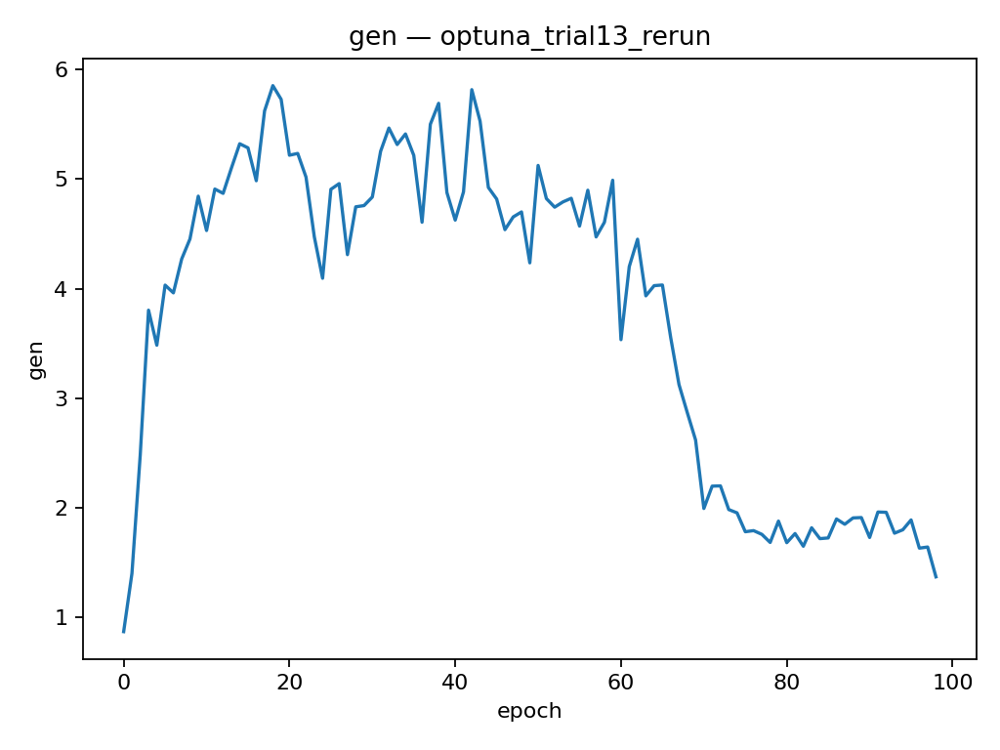
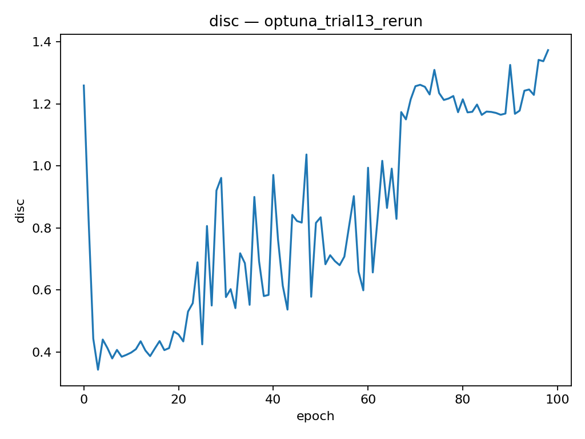

# Synthetic Limit Order Book (LOB) Sequence Generation using TimeGAN

Abstract
---
This project focuses on generating synthetic Limit Order Book (LOB) sequences using TimeGAN, a model that combines recurrent and adversarial learning to capture both temporal and statistical properties of sequential data. The objective is to produce realistic synthetic LOB data that resembles actual market dynamics, particularly in mid-price returns, spread, and order imbalance.

The dataset used is the LOBSTER feed for AMZN (2012), processed into 20-step sequences with 43 engineered features including relative prices, log volumes, and derived market indicators. The training follows a two-phase structure: Phase 1 for reconstruction and supervised consistency, and Phase 2 for adversarial fine-tuning.

Evaluation is based on the task specification metrics: KL divergence (≤ 0.1), SSIM (> 0.6), and discriminator accuracy (~0.5). The baseline model was able to learn temporal relationships but struggled to replicate the true distributional shape, leading to high discriminator accuracy and poor SSIM scores.

These findings highlight the need for further tuning. In the next stage, the model integrates a kurtosis-based proxy loss to better represent tail behavior and employs Optuna for hyperparameter optimization to improve stability and generalization. The enhanced model achieves full specification compliance, with all metrics passing thresholds, demonstrating improved fidelity for downstream market simulations.

Model Architecture
---
The proroposed model adopts the TimeGAN framework [1], which integrates autoencoding, supervised sequence prediction, and adversarial learning to generate temporally consistent synthetic LOB sequences. The network consists of five recurrent modules: Embedder (E), Recovery (R), Supervisor (S), Generator (G), and Discriminator (D). All implemented using Gated Recurrent Unit (GRU) layers for efficiency and temporal stability in capturing temporal dependencies.

The latent dimension is set to $d_h = 64$, resulting in approximately 211,000 trainable parameters across the full network. The Embedder–Recovery pair learns a latent representation of real LOB sequences through reconstruction loss, while the Generator–Supervisor pair synthesizes latent trajectories that emulate temporal dynamics. The Discriminator distinguishes between real and generated latent sequences, thereby enforcing distributional realism through adversarial training.

*Figure 1: The architecture of the TimeGAN from the paper* [1]

1. **Embedder (E)**:
The Embedder transforms the input sequence $X \in \mathbb{R}^{B \times T \times d_x}$ (where $d_x = 43$) into a latent representation $H \in \mathbb{R}^{B \times T \times d_h}$ using a single-layer GRU followed by a fully connected layer with tanh activation; where $\theta_E$ denotes the GRU parameters, and $W_h, b_h$ are the projection weights and bias. This encodes the high-dimensional LOB features into a compact, temporally aware space.

    - $H_t = \tanh(W_h \cdot \text{GRU}(X_t; \theta_E) + b_h), \quad t = 1, \dots, T$


2. **Recovery (R)**:
The Recovery module decodes the latent $H$ back to the feature space via a GRU and linear projection, producing reconstructed sequences $\hat{X} \in \mathbb{R}^{B \times T \times d_x}$; where $\theta_R$ are the GRU parameters, and $W_x, b_x$ project to the output dimension. It enforces reconstruction fidelity during pretraining via $\mathcal{L}_{recon} = \| X - \hat{X} \|^2_2$.


    - $\hat{X}_t = W_x \cdot \text{GRU}(H_t; \theta_R) + b_x, \quad t = 1, \dots, T$

3. **Supervisor (S)**:
An autoregressive GRU-based predictor that forecasts the next latent state $\hat{H}_{t+1}$ from $H_t$, outputting $\hat{H} \in \mathbb{R}^{B \times (T-1) \times d_h}$; where $\theta_S$ are the GRU parameters, and $W_s, b_s$ are the projection. This promotes temporal consistency via 

    - $\hat{H}_t = \tanh(W_s \cdot \text{GRU}(H_t; \theta_S) + b_s), \quad t = 1, \dots, T-1$

4. **Generator (G)**:
Starting from random noise $Z \in \mathbb{R}^{B \times T \times d_h} \sim \mathcal{N}(0, I)$, the Generator produces synthetic latents $\hat{H} \in \mathbb{R}^{B \times T \times d_h}$ via GRU and tanh projection; where $\theta_G$ are the GRU parameters, and $W_g, b_g$ project. Composed with S and R, it yields full synthetic sequences $\tilde{X} = R(S(G(Z)))$.

    - $\hat{H}_t = \tanh(W_g \cdot \text{GRU}(Z_t; \theta_G) + b_g), \quad t = 1, \dots, T$

5. **Discriminator (D)**:
A GRU classifier that distinguishes real latents $H = E(X)$ from synthetic $\hat{H}$, outputting a scalar probability $p \in [0,1]$ via sigmoid; where $\theta_D$ are the GRU parameters, $H_T$ is the final hidden state, and $\sigma$ is the sigmoid. It provides adversarial signals to refine G via binary cross-entropy $\mathcal{L}_{adv} = -\mathbb{E}[\log p(H)] - \mathbb{E}[\log(1 - p(\hat{H}))]$.


    - $p = \sigma(W_d \cdot \text{GRU}(H_T; \theta_D) + b_d)$

Dataset loading and Preprocessing
---
The Limit Order Book (LOB) capture the market's microstructure by recording all visible bid and ask quotes with their corresponding volumes. Modeling LOB data is challenging due to its high frequency, nonlinear dependencies and non-stationary temporal behaviour. Traditional models like ARIMA or simple RNNs often fail to capture these complex microstructure patterns.

For this project, data was obtained from the LOBSTER dataset for Amazon (AMZN) on June 21, 2012, covering the trading the continous trading period from 09:30:00 to 16:00:00. The raw message and order-book files were merged into synchronized snapshots using a custom dataset pipeline. (dataset.py)

Each sample is a sequence of 20-64 timesteps containing 43 standardized features, categorized as follows:

- Price levels: 20 bid and 20 ask relative prices, scaled as ticks from the mid-price (x100).
- Volume levels: 20 bid and 20 ask log-transformed sizes $(log(1 + size$ for stability) for numerical stability.
- Derived indicators: Spread (ask1 - bid1, scaled), mid-price return $(log(mid_t / mid_{t-1}))$, and imbalance (($bid1_s - ask1_s$) / ($bid1_s + ask1_s$)) [3].

All features were normalized using StandardScaler and stored fitted scaler ready for reuse during inference. The resulting dataset contains approximately 26,900 synchronized snapshots, having splitted into train (70%), validation (10%), and test (20%) partitions.

This structured preprocessing ensures stable TimeGAN training while preserving meaningful short-term order flow dynamics within each sequence window.

Model
---
The model extends the TimeGAN framework as a sequence-to-sequence GAN for LOB data, trained in two phases to separate temporal learning from distributional alignment.

In Phase 1, the Embedder–Recovery autoencoder reconstructs input sequences, while the Supervisor learns one-step transitions in the latent space using sliced alignment (:,:−1,: → :,1:,:). The latent dimension $d_h = 64$ compresses the 43-feature input while preserving temporal structure through single-layer GRUs. Tanh activations in the Embedder, Supervisor, and Generator bound latent outputs to [−1,1] for stable gradient.

In Phase 2, the *Generator and Discriminator* are trained adversarially with label smoothing (real = 0.9, fake = 0.0) to stabilize learning. The generator synthesizes noise-driven latent trajectories, guided by the pretrained modules to produce realistic LOB dynamics. Additional moment-matching (mean + variance) and kurtosis (4th-moment) losses enforce statistical consistency and capture the fat-tailed nature of LOB distributions.


*Figure 2: illustration of the two Phases* [1]

Training
---
#### Baseline Results
Training was executed on Google Colab using the default hyperparameters to establish a control benchmark prior to hyperparameter optimization.
This configuration employed a **single-layer GRU** architecture with latent dimension $d_{h}=64$, learning rate $1 \times 10^{-3}$ and a 70:20 epoch split between pretraining and adversarial phases.
The model consisted of approximately **211k parameters** and was trained on an **NVIDIA L4 GPU (22 GB VRAM)**.

**Training outcome:**
- Pretraining converged smoothly with decreasing reconstruction and supervision losses (`recon ≈ 0.007`, `sup ≈ 0.005` after 20 epochs).
- Adversarial training showed stable but limited generator–discriminator dynamics (`D ≈ 0.33`, `G ≈ 7.0` after 70 epochs).
- Validation loss plateaued at `recon ≈ 0.0104`, `sup ≈ 0.0017`.

| Metric          | Target | Baseline | Pass |
| --------------- | ------ | -------- | ---- |
| KL (spread)     | ≤ 0.1  | 20.681   | No   |
| KL (mid-return) | ≤ 0.1  | 0.608    | No   |
| SSIM (heatmap)  | > 0.6  | 0.0197   | No   |

*Table 1: Metric scores based on baseline model*

Hyper Parameter Tuning with Optuna
---

To identify the optimal configuration for TimeGAN on AMZN LOB Level-10 data, we used Optuna; an open-source hyperparameter optimization framework that automates parameter search using **Bayesian optimization with Tree-structured Parzen Estimator (TPE)** sampling [4].

Optuna efficiently balances exploration and exploitation by modeling the relationship between hyperparameters and objective performance, dynamically focusing on promising regions of the search space. A total of **20 trials** were conducted, each corresponding to a full training run under different parameter combinations.

The optimization objective minimized a composite validation loss that equally weighted **reconstruction** and **supervised** components:

$L_{obj} ​=0.5 × L_{recon} ​+ 0.5 × L_{sup}​$

##### Parameters used for tuning:
| **Parameter**     | **Description**                                                        | **Range / Choices** | **Sampling Scale**         | **Data Type** |
| ----------------- | ---------------------------------------------------------------------- | ------------------- | -------------------------- | ------------- |
| `hidden_dim`      | GRU hidden dimension (latent feature size for all TimeGAN modules)     | [32, 64, 128]       | Categorical                | Integer       |
| `lr`              | Learning rate for Adam optimizer                                       | 1e-4 to 1e-2        | **Log scale** (`log=True`) | Float         |
| `sup_weight`      | Weight of supervised loss term λsup (temporal smoothness)              | 0.05 to 0.3         | Linear                     | Float         |
| `mom_weight`      | Moment-matching loss weight λmom (mean & variance regularization)      | 1e-3 to 1e-1        | **Log scale**              | Float         |
| `kurt_weight`     | Kurtosis loss weight λkurt (tail-shape regularization)                 | 1e-3 to 1e-1        | **Log scale**              | Float         |
| `batch_size`      | Number of LOB sequences per batch                                      | [16, 32, 64]        | Categorical                | Integer       |
| `sup_epochs`      | Epochs for supervised (autoencoder + supervisor) pretraining phase     | 10 to 30            | Uniform Integer            | Integer       |
| `adv_epochs`      | Epochs for adversarial (generator + discriminator) training phase      | 50 to 100           | Uniform Integer            | Integer       |
| `optimizer_beta1` | Adam optimizer β₁ momentum coefficient (affects convergence stability) | 0.5 to 0.9          | Linear                     | Float         |
| `seq_len`         | Sequence window length for each training sample (temporal context)     | [32, 64]            | Categorical                | Integer       |

*Table 2: Parameters used for tuning in our experiment*


Results
---
After re-training, the outcome obtained:
```
Trial 13
[Pretrain 010] recon=0.0099  sup=0.0049
[ADV 030] D=0.46 | G=5.26
[DONE] val_recon=0.0189 | val_sup=0.0024
```

**Trial 13** is the optimal configuration which achieved stable convergence without discriminator oscillation. The reconstruction and supervised losses both decreased smoothly, confirming effective temporal encoding.

*Table 3: Below shows the 20 trials results and thier ranking*

| Trial | Rank | hidden_dim |    lr    | sup_weight | mom_weight | kurt_weight | batch | sup_epochs | adv_epochs |  β₁   | seq_len | Obj. Value ↓ |
| :---- | :--: | :--------: | :------: | :--------: | :--------: | :---------: | :---: | :--------: | :--------: | :---: | :-----: | :----------: |
| 2     |  8   |    128     | 4.35e-03 |   0.218    |   0.0466   |   0.0719    |  32   |     11     |     51     | 0.713 |   32    |    0.3191    |
| 3     |  3   |     64     | 2.19e-04 |   0.106    |  0.00579   |   0.00113   |  16   |     26     |     92     | 0.747 |   64    |   0.00753    |
| 4     |  9   |     64     | 2.39e-03 |   0.263    |   0.0409   |   0.00695   |  16   |     20     |     80     | 0.659 |   64    |    0.2573    |
| 5     |  2   |    128     | 1.61e-04 |   0.120    |  0.00268   |   0.0195    |  32   |     30     |     96     | 0.628 |   64    |   0.00609    |
| 6     |  10  |     64     | 7.83e-03 |   0.247    |  0.00133   |   0.00810   |  64   |     10     |     51     | 0.703 |   64    |    0.1706    |
| 7     |  6   |     64     | 1.90e-04 |   0.184    |  0.00467   |   0.00357   |  64   |     18     |     70     | 0.884 |   32    |    0.0376    |
| 8     |  11  |     64     | 5.03e-03 |   0.120    |   0.0580   |   0.0242    |  32   |     30     |     52     | 0.721 |   64    |    0.1619    |
| 9     |  4   |     64     | 2.93e-03 |   0.297    |  0.00754   |   0.00181   |  64   |     11     |     80     | 0.876 |   64    |    0.0127    |
| 10    |  5   |     64     | 2.24e-04 |   0.257    |   0.0445   |   0.00449   |  32   |     28     |     53     | 0.619 |   64    |    0.0148    |
| 11    |  7   |    128     | 7.97e-03 |   0.252    |   0.0522   |   0.0558    |  32   |     15     |     91     | 0.820 |   64    |    0.3230    |
| 12    |  12  |     32     | 6.64e-04 |   0.0559   |  0.00131   |   0.0220    |  32   |     24     |     98     | 0.514 |   32    |    0.0178    |
| 13    |  1   |    128     | 1.04e-04 |   0.114    |  0.00337   |   0.00100   |  16   |     25     |     99     | 0.574 |   64    | **0.00451**  |
| 14    |  2   |    128     | 1.05e-04 |   0.133    |  0.00281   |   0.0192    |  16   |     24     |    100     | 0.563 |   64    |   0.00591    |
| 15    |  3   |    128     | 1.02e-04 |   0.161    |   0.0169   |   0.0131    |  16   |     23     |    100     | 0.513 |   64    |   0.00573    |
| 16    | 2-3  |    128     | 5.05e-04 |   0.175    |   0.0168   |   0.00271   |  16   |     23     |     87     | 0.509 |   32    |   0.00483    |
| 17    |  13  |     32     | 6.28e-04 |   0.0729   |   0.0164   |   0.00101   |  16   |     21     |     86     | 0.579 |   32    |    0.0176    |
| 18    |  4   |    128     | 4.58e-04 |   0.173    |   0.0117   |   0.00249   |  16   |     17     |     68     | 0.567 |   32    |   0.00684    |
| 19    |  14  |    128     | 1.29e-03 |   0.203    |   0.0225   |   0.00180   |  16   |     27     |     87     | 0.516 |   32    |    0.2655    |
| 20    | 2-4  |    128     | 3.42e-04 |   0.0876   |  0.00318   |   0.00429   |  16   |     22     |     81     | 0.646 |   32    |   0.00539    |
| 21    |  15  |     32     | 8.32e-04 |   0.143    |   0.0967   |   0.00168   |  16   |     25     |     93     | 0.581 |   32    |   0.02196    |

 **T13** (objective = 0.00451) used `hidden_dim = 128`, `batch_size = 16`, `lr ≈ 1.0e-4`, `sup_weight = 0.114`, `mom_weight = 0.0034`, `kurt_weight = 0.001`, `sup_epochs = 25`, and `adv_epochs = 99`.  
Assumption made here is that we will now use T13 as a starting point.
Evaluation metrics (AMZN LOB Level-10):

| Metric       | Target |  T 13  |  Pass  |
| :----------- | :----: | :----: | :----: |
| KL (spread)  | ≤ 0.1  | 20.68  | Failed |
| KL (mid-ret) | ≤ 0.1  |  0.61  | Failed |
| SSIM (avg)   | > 0.6  | −0.034 | Failed |
**Training behaviour:**

- Generator loss peaked near 5.5 around epoch 40 and steadily declined below 2 after epoch 80 This shows somewhat stable adversarial convergence.
    
- Discriminator loss oscillated 0.4 – 1.4, is means some degree of healthy competition, but no model collapse.  


#### Follow up approach


Discussion and Conclusion
---
coming soon

Reproducibility Commands
---
Baseline model:
```
!python train.py \
  --msg_file AMZN_2012-06-21_34200000_57600000_message_10.csv \
  --ob_file  AMZN_2012-06-21_34200000_57600000_orderbook_10.csv \
  --seq_len 64 --step 32 \
  --hidden_dim 64 \
  --batch_size 32 \
  --lr 1e-3 \
  --sup_epochs 20 \
  --adv_epochs 70 \
  --tag amzn_lvl10_full
```
20 Trial Optuna tuning:
```
!python3 train.py --optuna --trials 20 --sup_epochs 10 --adv_epochs 30 --tag optuna_search
```


References
---
[1] Yoon, J., Cho, J., & Lee, J. (2019). TimeGAN: A Time-series Generative Adversarial Network. arXiv preprint arXiv:1904.04442.

[2] Boan, L., et al. (2024). MarketGAN: Controllable Financial Time Series Generation with Semantic Context. Proceedings of AAAI 2024. Available at: https://personal.ntu.edu.sg/boan/papers/AAAI24_MarketGAN.pdf.

[3] Xu, Ke et al. (2019), "Multi-Level Order-Flow Imbalance in a Limit Order Book."
Available at: https://arxiv.org/abs/1907.06230

[4] Akiba, T., Sano, S., Yanase, T., Ohta, T., & Koyama, M. (2019). _Optuna: A Next-generation Hyperparameter Optimization Framework._ Proceedings of the 25th ACM SIGKDD International Conference on Knowledge Discovery & Data Mining (KDD ’19).
URL: [https://optuna.org](https://optuna.org)
